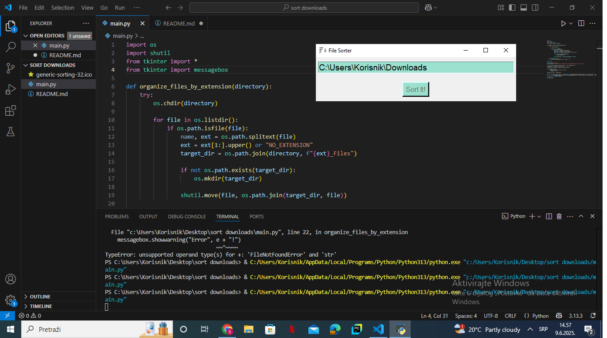

# File Sorter — Python Tkinter Application

## Description

File Sorter is a simple desktop application built with Python and Tkinter that helps you organize files in a specified folder by sorting them into subfolders based on their file extensions.

The program is useful for quickly tidying up cluttered folders such as your Downloads folder, by automatically moving files into appropriately named folders like `PDF_Files`, `JPG_Files`, etc.

---

## Features

- Easy-to-use graphical interface using Tkinter.
- Sorts files by their extensions into separate folders.
- Handles files without extensions by placing them in a `NO_EXTENSION_Files` folder.
- Basic error handling with user-friendly popup messages.
- Customizable directory input with placeholder text.
- Simple and clean design with adjustable fonts and colors.

---

## How to Use

1. Run the Python script (`file_sorter.py`).
2. Enter the full path of the directory you want to organize (e.g., `C:\Users\YourName\Downloads`).
3. Click the **Sort It!** button.
4. The application will automatically create folders for each file extension and move files accordingly.
5. If an error occurs (e.g., invalid directory), a popup message will notify you.

---

## Requirements

- Python 3.x
- Tkinter (usually included with standard Python installations)
- Works on Windows (tested with Windows 10)

---

## Optional Improvements

- Add directory browsing via a folder picker dialog.
- Add undo functionality to revert file moves.
- Improve UI with additional feedback/status labels.
- Extend support for recursive sorting into subfolders.

---

## Screenshots

---

## License

This project is open-source and free to use.
